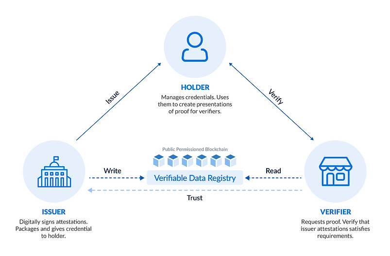

<h1 align="center"><b>DEMO</b></h1>

This is the Aries Framework Javascript demo. Walk through the AFJ flow yourself together with agents Alice and Faber.

Alice, a former student of Faber College, connects with the College, is issued a credential about her degree and then is asked by the College for a proof.

## Features

- ✅ Creating a connection
- ✅ Offering a credential
- ✅ Requesting a proof
- ✅ Sending basic messages

## Getting Started

### Platform Specific Setup

#### Install NodeJS
In order to use Aries Framework JavaScript some platform specific dependencies and setup is required. See our guides below to quickly set up you project with Aries Framework JavaScript for NodeJS, React Native and Electron.

- [NodeJS](https://aries.js.org/guides/getting-started/installation/nodejs)

#### Install Libindy
```sh
curl http://security.ubuntu.com/ubuntu/pool/main/o/openssl/libssl1.1_1.1.1-1ubuntu2.1~18.04.23_amd64.deb -o libssl1.1.deb
sudo dpkg -i libssl1.1.deb

curl http://security.ubuntu.com/ubuntu/pool/main/o/openssl/libssl-dev_1.1.1-1ubuntu2.1~18.04.23_amd64.deb  -o libssl-dev1.1.deb
sudo dpkg -i libssl-dev1.1.deb

sudo apt-key adv --keyserver keyserver.ubuntu.com --recv-keys CE7709D068DB5E88
sudo add-apt-repository "deb https://repo.sovrin.org/sdk/deb bionic stable"
sudo apt-get update -y
sudo apt-get install -y --allow-unauthenticated libindy
```


### Run the demo

These are the steps for running the AFJ demo:

Clone the AFJ git repository:

```sh
git clone https://github.com/trential/afj-demo.git 
```

Open two different terminals next to each other

Install the project in one of the terminals:

```sh
yarn install
```

In the left terminal run Alice:

```sh
yarn alice
```

In the right terminal run Faber:

```sh
yarn faber
```

### Usage

To set up a connection:

- Select 'receive connection invitation' in Alice and 'create connection invitation' in Faber
- Faber will print a invitation link which you then copy and paste to Alice
- You have now set up a connection!

To offer a credential:

- Select 'offer credential' in Faber
- Faber will start with registering a schema and the credential definition accordingly
- You have now send a credential offer to Alice!
- Go to Alice to accept the incoming credential offer by selecting 'yes'.

To request a proof:

- Select 'request proof' in Faber
- Faber will create a new proof attribute and will then send a proof request to Alice!
- Go to Alice to accept the incoming proof request

To send a basic message:

- Select 'send message' in either one of the Agents
- Type your message and press enter
- Message sent!

Exit:

- Select 'exit' to shutdown the agent.

Restart:

- Select 'restart', to shutdown the current agent and start a new one


## Concepts
### What is SSI?
Self-Sovereign Identity (SSI) is a user-centric approach to digital identity that gives people and organizations full control over their data. As a result, SSI enables anyone to easily share their data and reliably prove their identity (i.e. who they are and anything about them) without sacrificing security or privacy.

### How does SSI work?
SSI allows us to model digital identity just like we are used to the way identity works in the non-digital world based on paper documents and cards. There are just some minor twists.
For example, instead of our identity documents being made of paper or plastic, they are digital credentials made of bits and bytes and instead of storing them in wallets made of leather, they are stored in digital wallets on our phones. Importantly, these digital credentials can be reliably verified by anyone they are shared with online or offline.
In doing so, SSI enables decentralized ecosystems in which different parties can exchange and verify identity-related information. These ecosystems look like three-sided marketplaces, so that every party can take on three roles:
#### Issuers
Parties who “issue” identity-related data to people or organizations (“Holders”) in the form of digital credentials. They are the original data sources of an SSI ecosystem. For example, a government issues digital passports to citizens or a university issues digital diplomas to graduates.
#### Holders
Individuals or organizations who receive digital credentials that contain data about themselves from various sources (“Issuers”). By aggregating and storing such credentials in digital wallets, Holders can build holistic digital identities that are under their control and can easily be shared with third parties ("Verifiers").
#### Verifiers
Parties who rely on data to provide products and services can reliably verify and process data that has been provided by others (“Holders”). Verifiers, also called “Relying Parties”, are usually organizations or individuals in their professional capacity.



### Agents
An Aries agent is a piece of software that enables an entity (a person, organization or thing) to assume one or more of the roles within the SSI ecosystem — an issuer, holder and/or verifier — and allows that entity to interact with others that also have SSI Ecosystem roles.

### Connection
A connection enables secure, asynchronous, end-to-end encrypted messaging between agents, with messages (usually) routed through some configuration of intermediary agents.

### Credential
Verifiable Credentials or VCs are digital certificates that are standardized and provide a secure and private way to share information online - as they can be verified without revealing any unnecessary details. A verifiable credential is a digital representation of a person's identity information that has been cryptographically signed by an issuer. They provide an interoperable way to attest and authenticate any kind of data in an IDtech application.

When someone issues you a verifiable credential, it's stored in an SSI digital wallet, making it easy for you to securely and privately show them to others. A digital wallet is a software application and encrypted database that stores credentials, keys, and other secrets necessary for self-sovereign identity.

### Proof
Creating Verifiable Credentials involves generating cryptographic proofs that can be used to verify the authenticity of the VC. Digital signatures are generated using the issuer’s private key and these are used to create the proofs. When a verifier receives a VC, they can use the issuer’s public key to verify the credential’s signature and ensure that it hasn’t been tampered with. This allows information to be shared in a secure and trustworthy way between parties.
